# Medical Claims System

- In a Medical Claims System, logged in users submitting claims will need to upload photos of their receipts.
- Business Owner would like to be able to verify the authenticity of the receipts. They also want to split multi-page PDF into individual PNG files for ease of verification.
- Security team wants us to make sure that uploaded files are virus-free.
- UX team would like to be able to upload multiple files at the same time and let users preview the uploaded images before they submit.
- Performance Targets:
    - The daily active user count is 5,000
    - Max concurrent users: 300
    - Daily file uploads: 12,000 images
    - Response time targets:
        - 95% within 3 seconds.
        - 97% within 5 seconds.

## Logical View

### Milestone 01: Core File Upload MVP

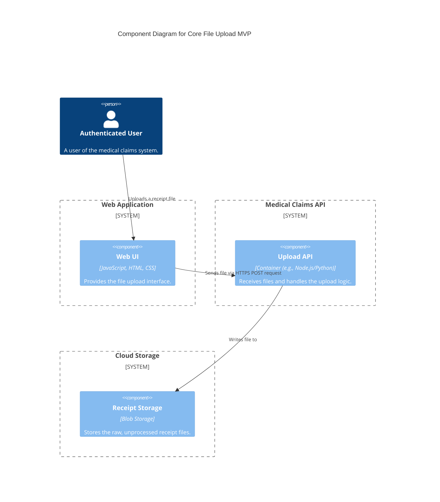
```mermaid
C4Component
  title Component Diagram for Core File Upload MVP

  Person(User, "Authenticated User", "A user of the medical claims system.")
  System_Boundary(WebAppBoundary, "Web Application") {
    Component(WebApp, "Web UI", "JavaScript, HTML, CSS", "Provides the file upload interface.")
  }
  System_Boundary(APIBoundary, "Medical Claims API") {
    Component(UploadAPI, "Upload API", "Container (e.g., Node.js/Python)", "Receives files and handles the upload logic.")
  }
  System_Boundary(StorageBoundary, "Cloud Storage") {
    Component(ReceiptStorage, "Receipt Storage", "Blob Storage", "Stores the raw, unprocessed receipt files.")
  }

  Rel(User, WebApp, "Uploads a receipt file")
  Rel(WebApp, UploadAPI, "Sends file via HTTPS POST request")
  Rel(UploadAPI, ReceiptStorage, "Writes file to")

  UpdateLayoutConfig($c4ShapeInRow="2", $c4BoundaryInRow="2")
```

### Milestone 02: Asynchronous & Scalable Uploads

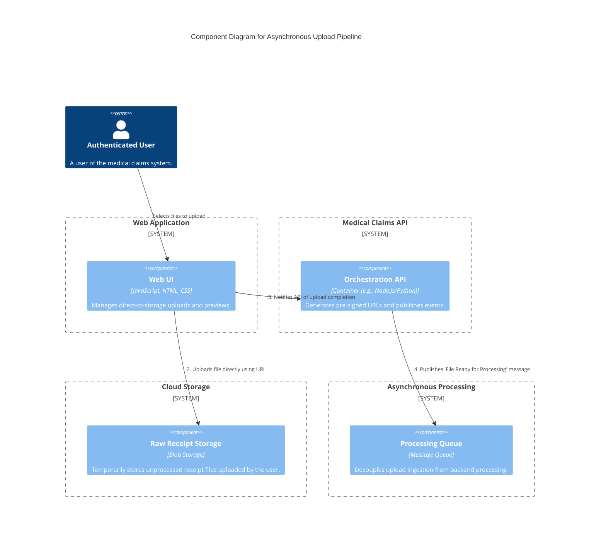
```mermaid
C4Component
  title Component Diagram for Asynchronous Upload Pipeline

  Person(User, "Authenticated User", "A user of the medical claims system.")

  System_Boundary(WebAppBoundary, "Web Application") {
    Component(WebApp, "Web UI", "JavaScript, HTML, CSS", "Manages direct-to-storage uploads and previews.")
  }

  System_Boundary(APIBoundary, "Medical Claims API") {
    Component(OrchestrationAPI, "Orchestration API", "Container (e.g., Node.js/Python)", "Generates pre-signed URLs and publishes events.")
  }

  System_Boundary(StorageBoundary, "Cloud Storage") {
    Component(RawStorage, "Raw Receipt Storage", "Blob Storage", "Temporarily stores unprocessed receipt files uploaded by the user.")
  }

  System_Boundary(ProcessingBoundary, "Asynchronous Processing") {
     Component(ProcessingQueue, "Processing Queue", "Message Queue", "Decouples upload ingestion from backend processing.")
  }

  %% Step-by-step user and system interactions
  Rel(User, WebApp, "Selects files to upload")
  Rel(WebApp, OrchestrationAPI, "1. Requests Pre-Signed URL(s)")
  
  %% This is the critical direct-to-storage relationship
  Rel(WebApp, RawStorage, "2. Uploads file directly using URL")
  
  %% Notification and handoff to the backend
  Rel(WebApp, OrchestrationAPI, "3. Notifies API of upload completion")
  Rel(OrchestrationAPI, ProcessingQueue, "4. Publishes 'File Ready for Processing' message")

  UpdateLayoutConfig($c4ShapeInRow="2", $c4BoundaryInRow="2")
```

### Milestone 03: Security Integration - Virus Scanning

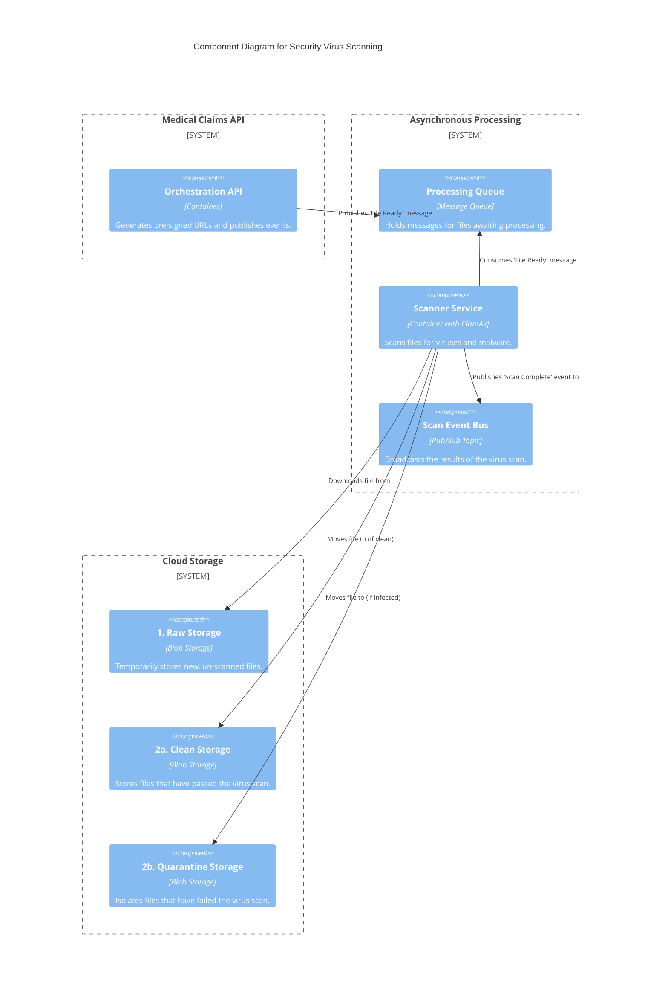
```mermaid
C4Component
  title Component Diagram for Security Virus Scanning

  System_Boundary(APIBoundary, "Medical Claims API") {
    Component(OrchestrationAPI, "Orchestration API", "Container", "Generates pre-signed URLs and publishes events.")
  }

  System_Boundary(ProcessingBoundary, "Asynchronous Processing") {
    Component(ProcessingQueue, "Processing Queue", "Message Queue", "Holds messages for files awaiting processing.")
    Component(Scanner, "Scanner Service", "Container with ClamAV", "Scans files for viruses and malware.")
    Component(ScanEventBus, "Scan Event Bus", "Pub/Sub Topic", "Broadcasts the results of the virus scan.")
  }

  System_Boundary(StorageBoundary, "Cloud Storage") {
    Component(RawStorage, "1. Raw Storage", "Blob Storage", "Temporarily stores new, un-scanned files.")
    Component(CleanStorage, "2a. Clean Storage", "Blob Storage", "Stores files that have passed the virus scan.")
    Component(QuarantineStorage, "2b. Quarantine Storage", "Blob Storage", "Isolates files that have failed the virus scan.")
  }

  %% Correct Data Flow
  Rel(OrchestrationAPI, ProcessingQueue, "Publishes 'File Ready' message")
  
  %% Scanner PULLS from the queue
  Rel(Scanner, ProcessingQueue, "Consumes 'File Ready' message")

  %% Scanner interacts with storage
  Rel_D(Scanner, RawStorage, "Downloads file from")
  Rel_D(Scanner, CleanStorage, "Moves file to (if clean)")
  Rel_D(Scanner, QuarantineStorage, "Moves file to (if infected)")
  
  %% Scanner PUSHES to the event bus for downstream services
  Rel_D(Scanner, ScanEventBus, "Publishes 'Scan Complete' event to")

  UpdateLayoutConfig($c4ShapeInRow="3")
```

### Milestone 04: Business Logic - PDF Splitting

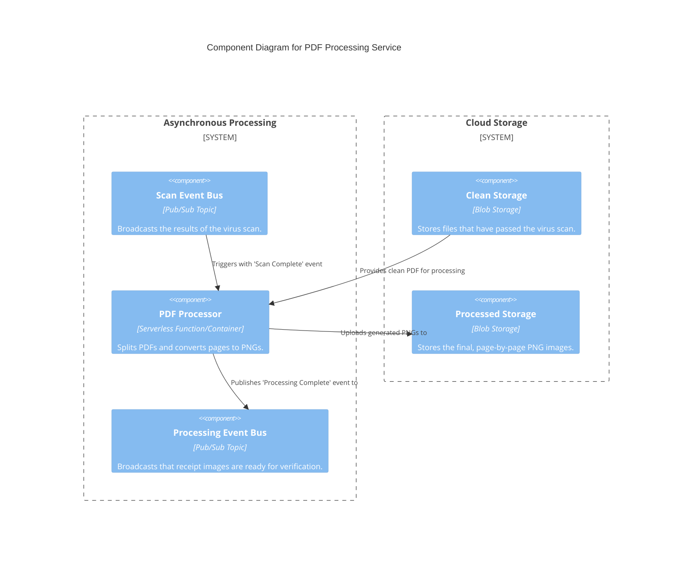
```mermaid
C4Component
    title Component Diagram for PDF Processing Service

    System_Boundary(ProcessingBoundary, "Asynchronous Processing") {
        Component(ScanEventBus, "Scan Event Bus", "Pub/Sub Topic", "Broadcasts the results of the virus scan.")
        Component(PDF_Processor, "PDF Processor", "Serverless Function/Container", "Splits PDFs and converts pages to PNGs.")
        Component(ProcessingEventBus, "Processing Event Bus", "Pub/Sub Topic", "Broadcasts that receipt images are ready for verification.")
    }

    System_Boundary(StorageBoundary, "Cloud Storage") {
        Component(CleanStorage, "Clean Storage", "Blob Storage", "Stores files that have passed the virus scan.")
        Component(ProcessedStorage, "Processed Storage", "Blob Storage", "Stores the final, page-by-page PNG images.")
    }

    %% Corrected Relationships Showing Data Flow
    %% The event flows FROM the bus TO the processor
    Rel(ScanEventBus, PDF_Processor, "Triggers with 'Scan Complete' event")

    %% The PDF data flows FROM Clean Storage TO the processor
    Rel(CleanStorage, PDF_Processor, "Provides clean PDF for processing")

    %% The PNG data flows FROM the processor TO Processed Storage
    Rel(PDF_Processor, ProcessedStorage, "Uploads generated PNGs to")

    %% The new event flows FROM the processor TO the next event bus
    Rel(PDF_Processor, ProcessingEventBus, "Publishes 'Processing Complete' event to")

    UpdateLayoutConfig($c4ShapeInRow="2")
```

### Milestone 05: Business Logic - Receipt Authenticity Verification

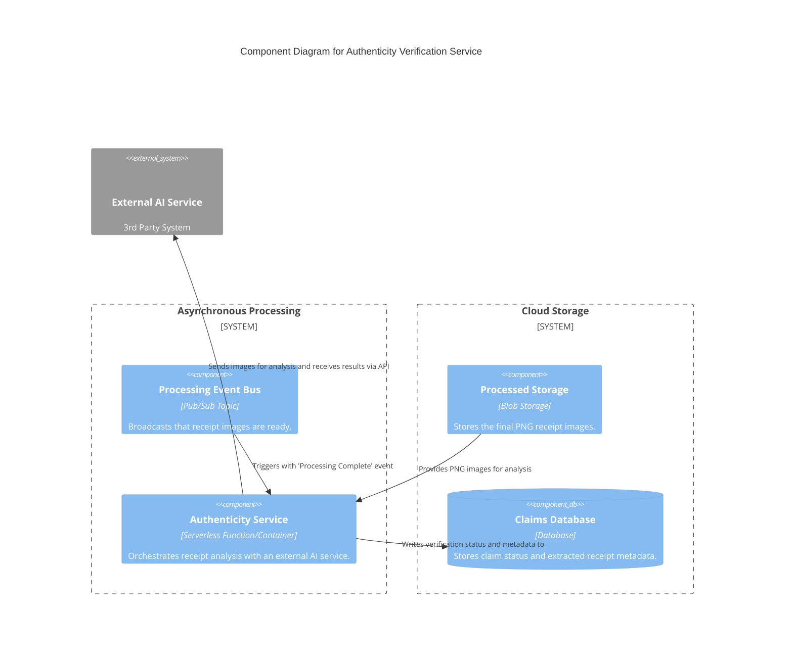
```mermaid
C4Component
    title Component Diagram for Authenticity Verification Service

    System_Boundary(ProcessingBoundary, "Asynchronous Processing") {
        Component(ProcessingEventBus, "Processing Event Bus", "Pub/Sub Topic", "Broadcasts that receipt images are ready.")
        Component(AuthenticitySvc, "Authenticity Service", "Serverless Function/Container", "Orchestrates receipt analysis with an external AI service.")
    }

    System_Boundary(StorageBoundary, "Cloud Storage") {
        Component(ProcessedStorage, "Processed Storage", "Blob Storage", "Stores the final PNG receipt images.")
        ComponentDb(ClaimsDB, "Claims Database", "Database", "Stores claim status and extracted receipt metadata.")
    }
    
    System_Ext(AI_Service, "External AI Service", "3rd Party System", "Provides OCR and document analysis capabilities.")

    %% Corrected Relationships Showing Data Flow
    Rel(ProcessingEventBus, AuthenticitySvc, "Triggers with 'Processing Complete' event")
    
    %% Data flows FROM storage TO the service
    Rel(ProcessedStorage, AuthenticitySvc, "Provides PNG images for analysis")

    %% Data flows FROM the service TO the external system and back
    Rel(AuthenticitySvc, AI_Service, "Sends images for analysis and receives results via API")
    
    %% Data flows FROM the service TO the database
    Rel(AuthenticitySvc, ClaimsDB, "Writes verification status and metadata to")

    UpdateLayoutConfig($c4ShapeInRow="2")
```

### Milestone 06: High Availability & Scalability

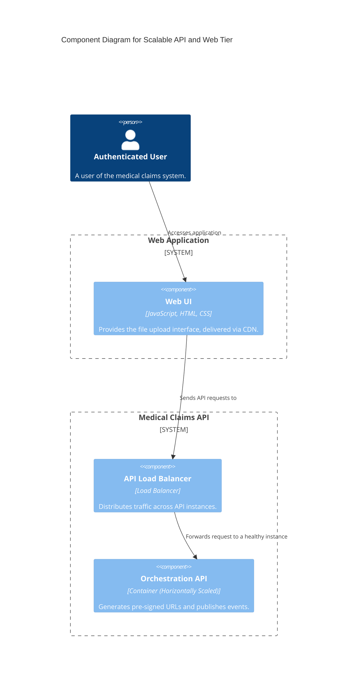
```mermaid
C4Component
    title Component Diagram for Scalable API and Web Tier

    Person(User, "Authenticated User", "A user of the medical claims system.")
    
    System_Boundary(WebAppBoundary, "Web Application") {
        Component(WebApp, "Web UI", "JavaScript, HTML, CSS", "Provides the file upload interface, delivered via CDN.")
    }
    
    System_Boundary(APIBoundary, "Medical Claims API") {
        Component(LoadBalancer, "API Load Balancer", "Load Balancer", "Distributes traffic across API instances.")
        Component(OrchestrationAPI, "Orchestration API", "Container (Horizontally Scaled)", "Generates pre-signed URLs and publishes events.")
    }

    Rel(User, WebApp, "Accesses application")
    Rel(WebApp, LoadBalancer, "Sends API requests to")
    Rel(LoadBalancer, OrchestrationAPI, "Forwards request to a healthy instance")

    UpdateLayoutConfig($c4ShapeInRow="2", $c4BoundaryInRow="1")
```

### Milestone 07: Data Persistence & Lifecycle Tracking

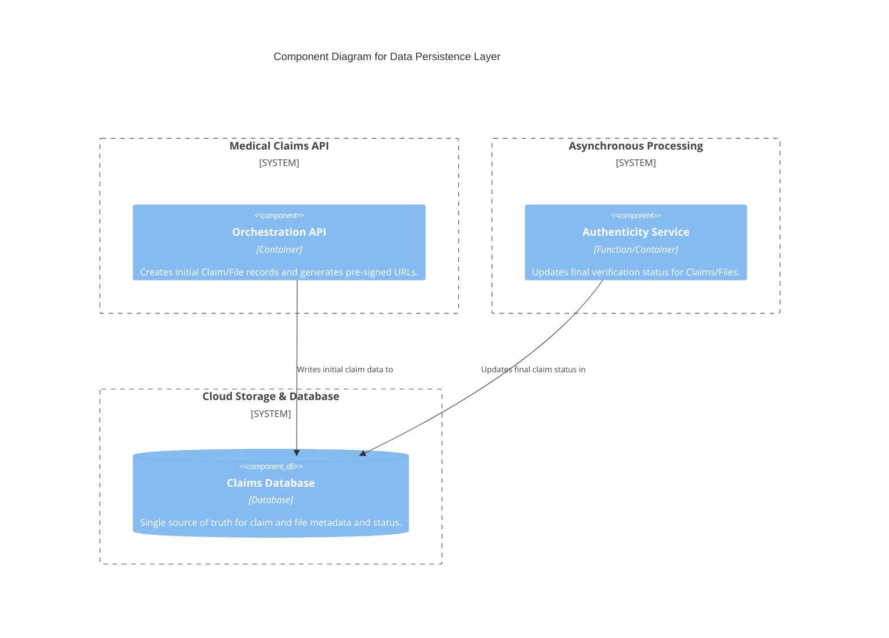
```mermaid
C4Component
    title Component Diagram for Data Persistence Layer

    System_Boundary(APIBoundary, "Medical Claims API") {
        Component(OrchestrationAPI, "Orchestration API", "Container", "Creates initial Claim/File records and generates pre-signed URLs.")
    }

    System_Boundary(ProcessingBoundary, "Asynchronous Processing") {
        Component(AuthenticitySvc, "Authenticity Service", "Function/Container", "Updates final verification status for Claims/Files.")
    }

    System_Boundary(StorageBoundary, "Cloud Storage & Database") {
        ComponentDb(ClaimsDB, "Claims Database", "Database", "Single source of truth for claim and file metadata and status.")
    }

    %% Relationships
    Rel(OrchestrationAPI, ClaimsDB, "Writes initial claim data to")
    Rel(AuthenticitySvc, ClaimsDB, "Updates final claim status in")

    UpdateLayoutConfig($c4ShapeInRow="2")
```

### Milestone 08: Production Observability

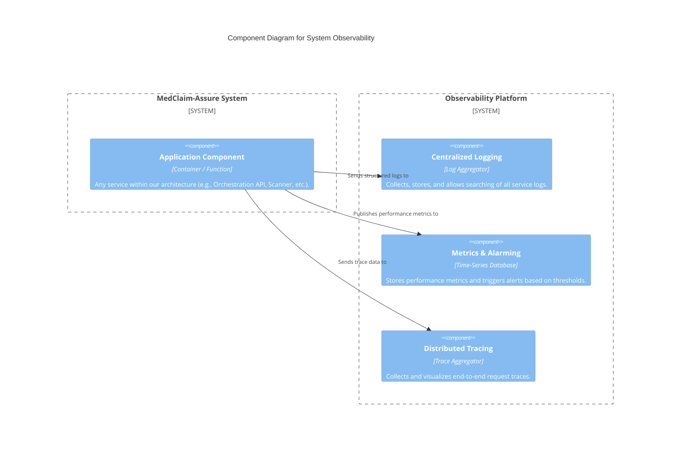
```mermaid
C4Component
    title Component Diagram for System Observability

    System_Boundary(MedClaimBoundary, "MedClaim-Assure System") {
        Component(Service, "Application Component", "Container / Function", "Any service within our architecture (e.g., Orchestration API, Scanner, etc.).")
    }
    
    System_Boundary(ObservabilityBoundary, "Observability Platform") {
        Component(Logging, "Centralized Logging", "Log Aggregator", "Collects, stores, and allows searching of all service logs.")
        Component(Metrics, "Metrics & Alarming", "Time-Series Database", "Stores performance metrics and triggers alerts based on thresholds.")
        Component(Tracing, "Distributed Tracing", "Trace Aggregator", "Collects and visualizes end-to-end request traces.")
    }

    Rel(Service, Logging, "Sends structured logs to")
    Rel(Service, Metrics, "Publishes performance metrics to")
    Rel(Service, Tracing, "Sends trace data to")

    UpdateLayoutConfig($c4ShapeInRow="3")
```

### Milestone 09: Comprehensive End-to-End Security

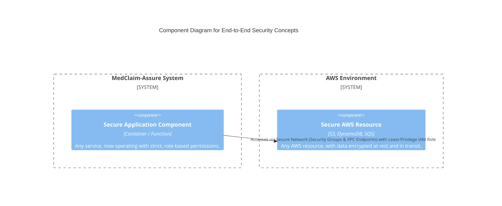
```mermaid
C4Component
    title Component Diagram for End-to-End Security Concepts

    System_Boundary(MedClaimBoundary, "MedClaim-Assure System") {
        Component(SecureComponent, "Secure Application Component", "Container / Function", "Any service, now operating with strict, role-based permissions.")
    }
    
    System_Boundary(AWS_Boundary, "AWS Environment") {
        Component(SecureResource, "Secure AWS Resource", "S3, DynamoDB, SQS", "Any AWS resource, with data encrypted at rest and in transit.")
    }

    Rel(SecureComponent, SecureResource, "Accesses via Secure Network (Security Groups & VPC Endpoints) with Least-Privilege IAM Role")

    UpdateLayoutConfig($c4ShapeInRow="2")
```

## Physical View

### Milestone 01: Core File Upload MVP

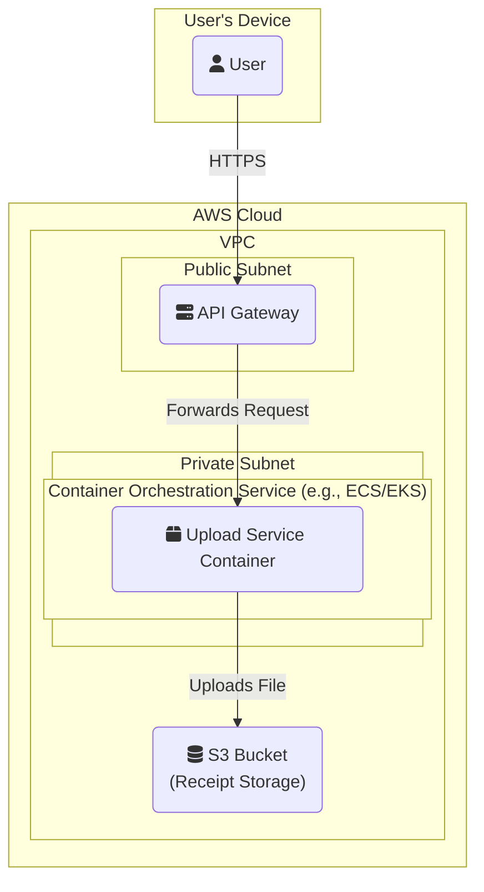
```mermaid
graph TD
    subgraph "User's Device"
        User("fa:fa-user User")
    end

    subgraph "AWS Cloud"
        subgraph "VPC"
            subgraph "Public Subnet"
                APIGateway("fa:fa-server API Gateway")
            end

            subgraph "Private Subnet"
                subgraph "Container Orchestration Service (e.g., ECS/EKS)"
                    UploadServiceContainer("fa:fa-box Upload Service Container")
                end
            end

            S3("fa:fa-database S3 Bucket<br>(Receipt Storage)")
        end
    end

    User -- "HTTPS" --> APIGateway
    APIGateway -- "Forwards Request" --> UploadServiceContainer
    UploadServiceContainer -- "Uploads File" --> S3
```

### Milestone 02: Asynchronous & Scalable Uploads

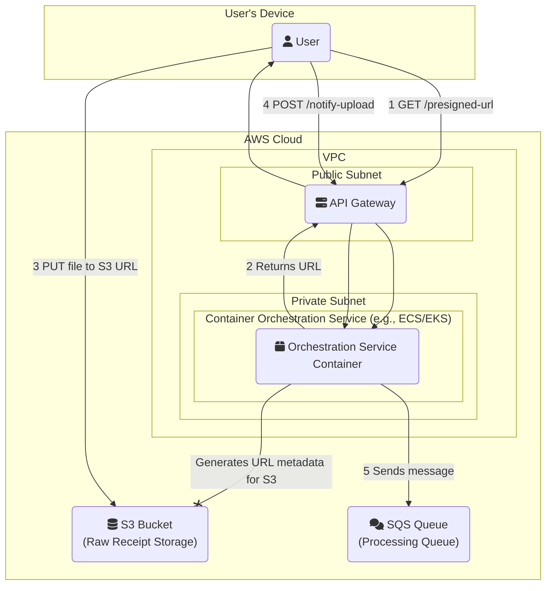
```mermaid
graph TD
    subgraph "User's Device"
        User("fa:fa-user User")
    end

    subgraph "AWS Cloud"
        subgraph "VPC"
            subgraph "Public Subnet"
                APIGateway("fa:fa-server API Gateway")
            end

            subgraph "Private Subnet"
                subgraph "Container Orchestration Service (e.g., ECS/EKS)"
                    OrchestrationService("fa:fa-box Orchestration Service Container")
                end
            end
        end

        S3("fa:fa-database S3 Bucket<br>(Raw Receipt Storage)")
        SQS("fa:fa-comments SQS Queue<br>(Processing Queue)")
    end

    %% User Flow for Pre-Signed URL Generation and Upload %%
    User -- "1 GET /presigned-url" --> APIGateway
    APIGateway -- " " --> OrchestrationService
    OrchestrationService -- "Generates URL metadata for S3" --x S3
    OrchestrationService -- "2 Returns URL" --> APIGateway
    APIGateway -- " " --> User

    %% Direct Upload and Asynchronous Notification %%
    User -- "3 PUT file to S3 URL" --> S3
    User -- "4 POST /notify-upload" --> APIGateway
    APIGateway -- " " --> OrchestrationService
    OrchestrationService -- "5 Sends message" --> SQS
```

### Milestone 03: Security Integration - Virus Scanning

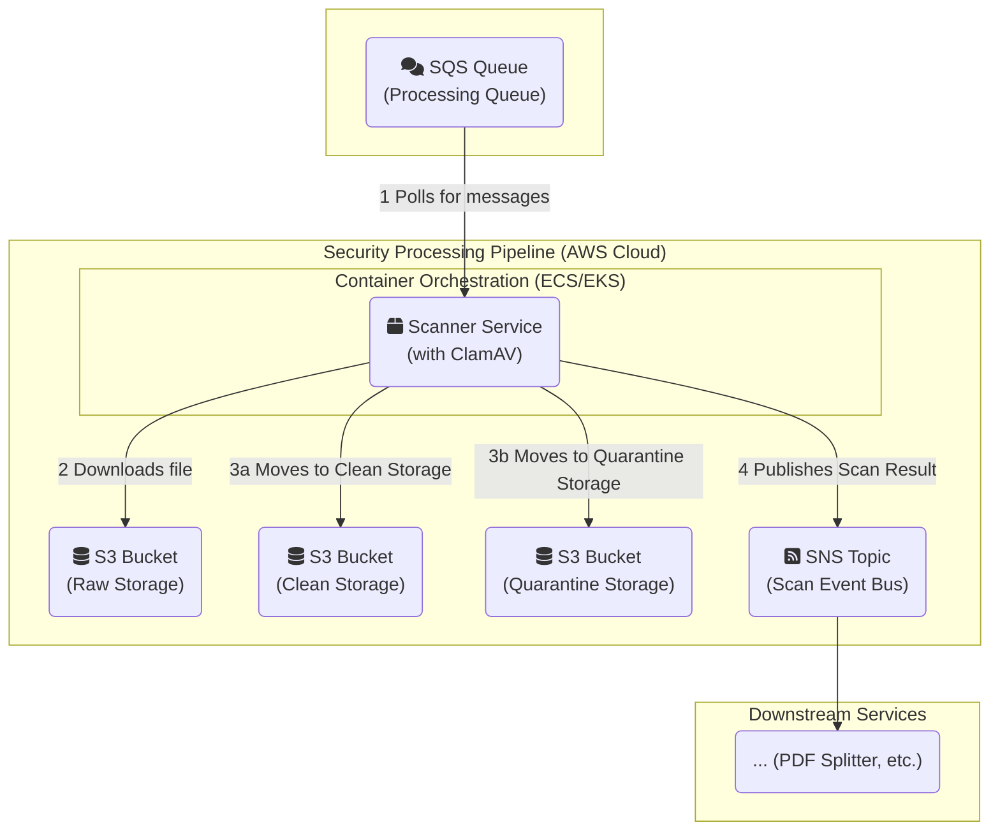
```mermaid
graph TD
    %% Handoff from the previous stage
    subgraph " "
     direction LR
     SQS("fa:fa-comments SQS Queue<br>(Processing Queue)")
    end

    subgraph "Security Processing Pipeline (AWS Cloud)"
        direction TB

        %% The core service that does the work
        subgraph "Container Orchestration (ECS/EKS)"
            ScannerService("fa:fa-box Scanner Service<br>(with ClamAV)")
        end

        %% The storage resources it interacts with
        RawS3("fa:fa-database S3 Bucket<br>(Raw Storage)")
        CleanS3("fa:fa-database S3 Bucket<br>(Clean Storage)")
        QuarantineS3("fa:fa-database S3 Bucket<br>(Quarantine Storage)")

        %% The event bus for broadcasting results
        SNS("fa:fa-rss-square SNS Topic<br>(Scan Event Bus)")
    end

    %% Placeholder for the next stages in the architecture
    subgraph "Downstream Services"
     direction LR
     Placeholder("... (PDF Splitter, etc.)")
    end

    %% Define the sequence of operations with corrected labels
    SQS -- "1 Polls for messages" --> ScannerService
    ScannerService -- "2 Downloads file" --> RawS3
    ScannerService -- "3a Moves to Clean Storage" --> CleanS3
    ScannerService -- "3b Moves to Quarantine Storage" --> QuarantineS3
    ScannerService -- "4 Publishes Scan Result" --> SNS
    SNS -- " " --> Placeholder
```

### Milestone 04: Business Logic - PDF Splitting

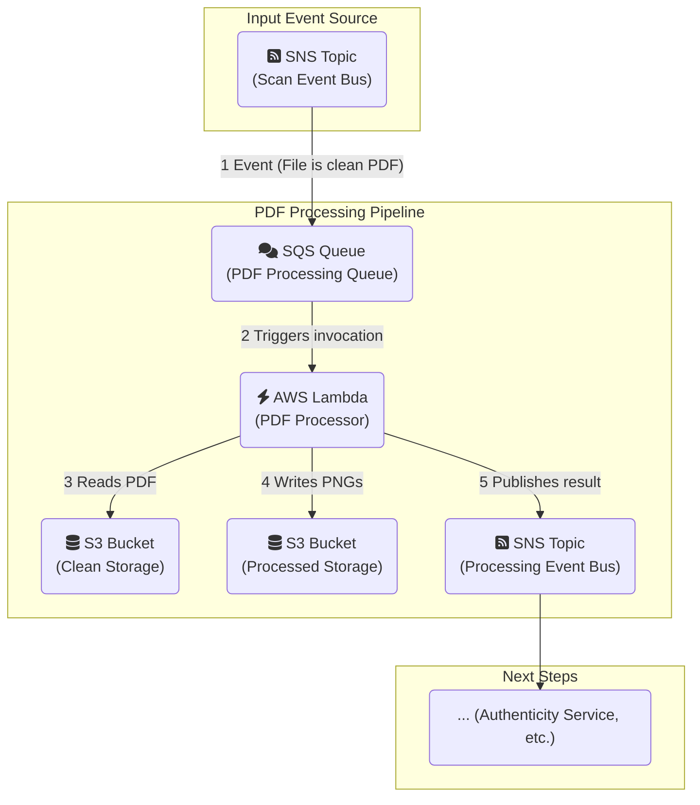
```mermaid
graph TD
    %% Input from the previous stage
    subgraph "Input Event Source"
        SNS_Scan("fa:fa-rss-square SNS Topic<br>(Scan Event Bus)")
    end

    subgraph "PDF Processing Pipeline"
        %% SQS provides a resilient buffer before Lambda
        SQS_PDF("fa:fa-comments SQS Queue<br>(PDF Processing Queue)")
        
        %% Lambda is ideal for event-driven compute
        Lambda("fa:fa-bolt AWS Lambda<br>(PDF Processor)")

        %% Storage buckets
        CleanS3("fa:fa-database S3 Bucket<br>(Clean Storage)")
        ProcessedS3("fa:fa-database S3 Bucket<br>(Processed Storage)")
        
        %% Output for the next stage
        SNS_Process("fa:fa-rss-square SNS Topic<br>(Processing Event Bus)")
    end

    %% Downstream services will subscribe here
    subgraph "Next Steps"
        Placeholder("... (Authenticity Service, etc.)")
    end

    %% Data Flow with corrected labels
    SNS_Scan -- "1 Event (File is clean PDF)" --> SQS_PDF
    SQS_PDF -- "2 Triggers invocation" --> Lambda
    Lambda -- "3 Reads PDF" --> CleanS3
    Lambda -- "4 Writes PNGs" --> ProcessedS3
    Lambda -- "5 Publishes result" --> SNS_Process
    SNS_Process --> Placeholder
```

### Milestone 05: Business Logic - Receipt Authenticity Verification

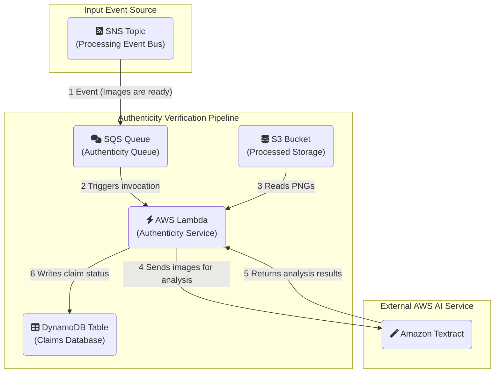
```mermaid
graph TD
    %% Input from the previous stage
    subgraph "Input Event Source"
        SNS_Process("fa:fa-rss-square SNS Topic<br>(Processing Event Bus)")
    end

    subgraph "Authenticity Verification Pipeline"
        %% SQS provides a resilient buffer
        SQS_Auth("fa:fa-comments SQS Queue<br>(Authenticity Queue)")
        
        %% Lambda for the service logic
        Lambda_Auth("fa:fa-bolt AWS Lambda<br>(Authenticity Service)")

        %% Final data store
        DynamoDB("fa:fa-table DynamoDB Table<br>(Claims Database)")
        
        %% Source image store
        ProcessedS3("fa:fa-database S3 Bucket<br>(Processed Storage)")
    end
    
    %% External AI Service
    subgraph "External AWS AI Service"
        Textract("fa:fa-magic Amazon Textract")
    end

    %% Data Flow with corrected S3 read direction
    SNS_Process -- "1 Event (Images are ready)" --> SQS_Auth
    SQS_Auth -- "2 Triggers invocation" --> Lambda_Auth
    
    %% CORRECTED FLOW: Data flows FROM S3 TO Lambda
    ProcessedS3 -- "3 Reads PNGs" --> Lambda_Auth
    
    Lambda_Auth -- "4 Sends images for analysis" --> Textract
    Textract -- "5 Returns analysis results" --> Lambda_Auth
    Lambda_Auth -- "6 Writes claim status" --> DynamoDB
```

### Milestone 06: High Availability & Scalability

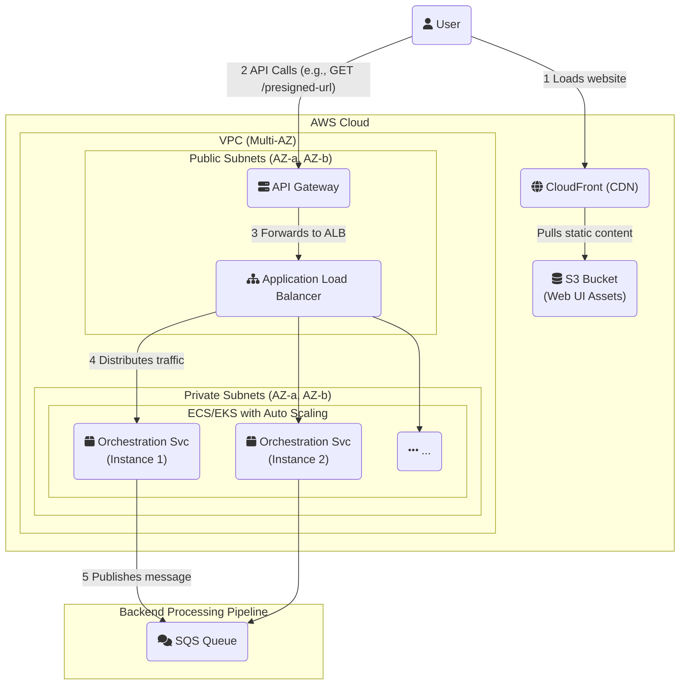
```mermaid
graph TD
    User("fa:fa-user User")

    subgraph "AWS Cloud"
        %% CDN Layer for the Web UI
        CloudFront("fa:fa-globe CloudFront (CDN)")
        S3_WebApp("fa:fa-database S3 Bucket<br>(Web UI Assets)")
        
        subgraph "VPC (Multi-AZ)"
            subgraph "Public Subnets (AZ-a, AZ-b)"
                APIGateway("fa:fa-server API Gateway")
                ALB("fa:fa-sitemap Application Load Balancer")
            end

            subgraph "Private Subnets (AZ-a, AZ-b)"
                subgraph "ECS/EKS with Auto Scaling"
                    Orchestration_A("fa:fa-box Orchestration Svc<br>(Instance 1)")
                    Orchestration_B("fa:fa-box Orchestration Svc<br>(Instance 2)")
                    Orchestration_N("fa:fa-ellipsis-h ...")
                end
            end
        end
    end
    
    %% Backend services from previous issues remain unchanged
    subgraph "Backend Processing Pipeline"
        SQS("fa:fa-comments SQS Queue")
    end

    %% Data Flow with corrected labels
    User -- "1 Loads website" --> CloudFront
    CloudFront -- "Pulls static content" --> S3_WebApp

    User -- "2 API Calls (e.g., GET /presigned-url)" --> APIGateway
    APIGateway -- "3 Forwards to ALB" --> ALB
    ALB -- "4 Distributes traffic" --> Orchestration_A
    ALB -- " " --> Orchestration_B
    ALB -- " " --> Orchestration_N
    
    Orchestration_A -- "5 Publishes message" --> SQS
    Orchestration_B -- " " --> SQS
```

### Milestone 07: Data Persistence & Lifecycle Tracking

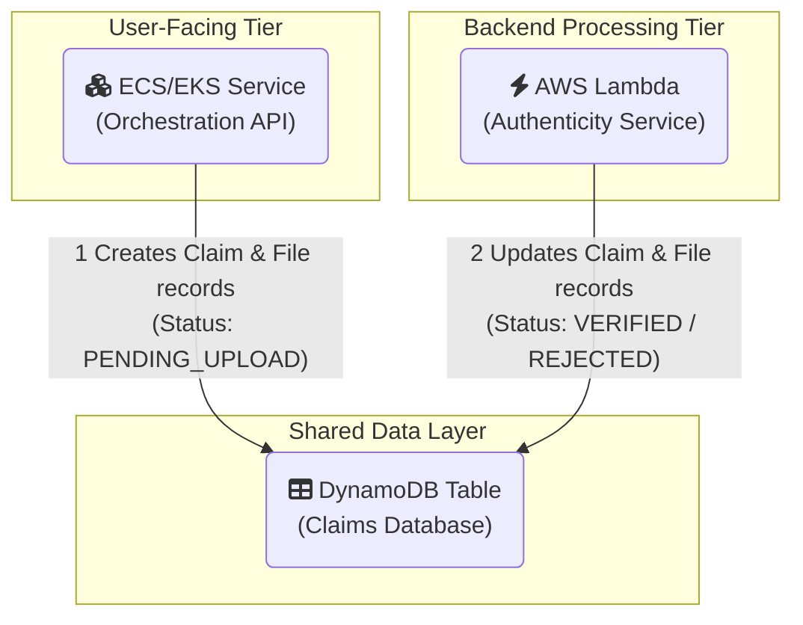
```mermaid
graph TD
    subgraph "User-Facing Tier"
        Orchestration_Services("fa:fa-cubes ECS/EKS Service<br>(Orchestration API)")
    end

    subgraph "Backend Processing Tier"
        Lambda_Auth("fa:fa-bolt AWS Lambda<br>(Authenticity Service)")
    end
    
    subgraph "Shared Data Layer"
        DynamoDB("fa:fa-table DynamoDB Table<br>(Claims Database)")
    end

    %% Data Flow with corrected labels
    Orchestration_Services -- "1 Creates Claim & File records<br>(Status: PENDING_UPLOAD)" --> DynamoDB
    
    %% This comment represents the time gap where the async pipeline runs
    
    Lambda_Auth -- "2 Updates Claim & File records<br>(Status: VERIFIED / REJECTED)" --> DynamoDB
```

### Milestone 08: Production Observability

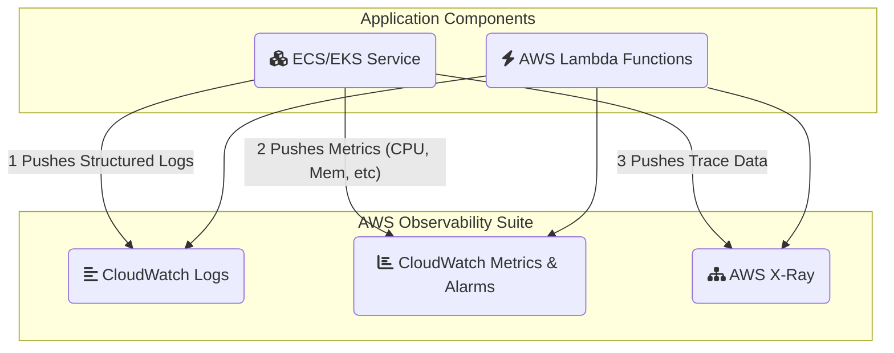
```mermaid
graph TD
    subgraph "Application Components"
        direction TB
        Orchestration_Services("fa:fa-cubes ECS/EKS Service")
        Lambda_Functions("fa:fa-bolt AWS Lambda Functions")
    end

    subgraph "AWS Observability Suite"
        direction TB
        CloudWatchLogs("fa:fa-align-left CloudWatch Logs")
        CloudWatchMetrics("fa:fa-bar-chart CloudWatch Metrics & Alarms")
        XRay("fa:fa-sitemap AWS X-Ray")
    end
    
    %% Data Flow with corrected labels
    Orchestration_Services -- "1 Pushes Structured Logs" --> CloudWatchLogs
    Lambda_Functions -- " " --> CloudWatchLogs
    
    Orchestration_Services -- "2 Pushes Metrics (CPU, Mem, etc)" --> CloudWatchMetrics
    Lambda_Functions -- " " --> CloudWatchMetrics
    
    Orchestration_Services -- "3 Pushes Trace Data" --> XRay
    Lambda_Functions -- " " --> XRay
```

### Milestone 09: Comprehensive End-to-End Security

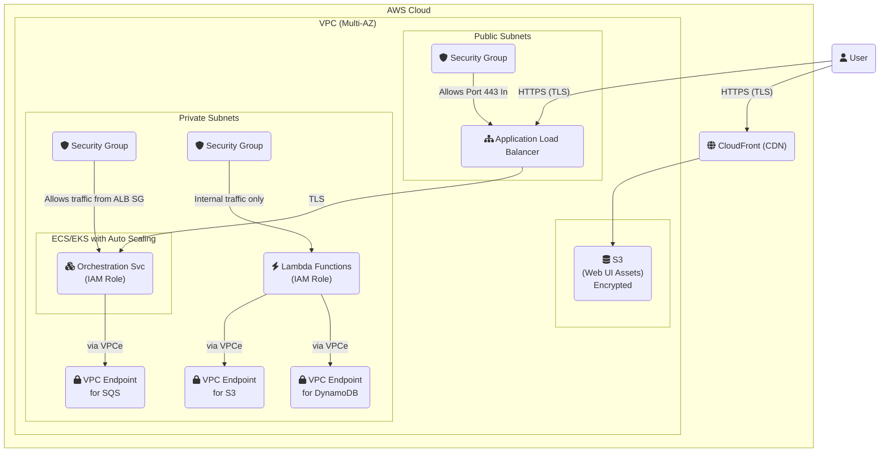
```mermaid
graph TD
    User("fa:fa-user User")

    subgraph "AWS Cloud"
        CloudFront("fa:fa-globe CloudFront (CDN)")
        
        subgraph "VPC (Multi-AZ)"
            subgraph " "
                direction LR
                S3_WebApp("fa:fa-database S3<br>(Web UI Assets)<br>Encrypted")
            end

            subgraph "Public Subnets"
                sg_alb("fa:fa-shield Security Group")
                ALB("fa:fa-sitemap Application Load Balancer")
                sg_alb -- "Allows Port 443 In" --> ALB
            end

            subgraph "Private Subnets"
                sg_ecs("fa:fa-shield Security Group")
                subgraph "ECS/EKS with Auto Scaling"
                    Orchestration_Services("fa:fa-cubes Orchestration Svc<br>(IAM Role)")
                end
                sg_ecs -- "Allows traffic from ALB SG" --> Orchestration_Services
                
                %% Backend Lambda services
                sg_lambda("fa:fa-shield Security Group")
                Lambda_Functions("fa:fa-bolt Lambda Functions<br>(IAM Role)")
                sg_lambda -- "Internal traffic only" --> Lambda_Functions
                
                %% VPC Endpoints
                VPCE_S3("fa:fa-lock VPC Endpoint<br>for S3")
                VPCE_SQS("fa:fa-lock VPC Endpoint<br>for SQS")
                VPCE_Dynamo("fa:fa-lock VPC Endpoint<br>for DynamoDB")
                
                Orchestration_Services -- "via VPCe" --> VPCE_SQS
                Lambda_Functions -- "via VPCe" --> VPCE_S3
                Lambda_Functions -- "via VPCe" --> VPCE_Dynamo
            end
        end
    end
    
    %% User Traffic Flow
    User -- "HTTPS (TLS)" --> CloudFront
    CloudFront --> S3_WebApp
    User -- "HTTPS (TLS)" --> ALB
    ALB -- "TLS" --> Orchestration_Services
```
