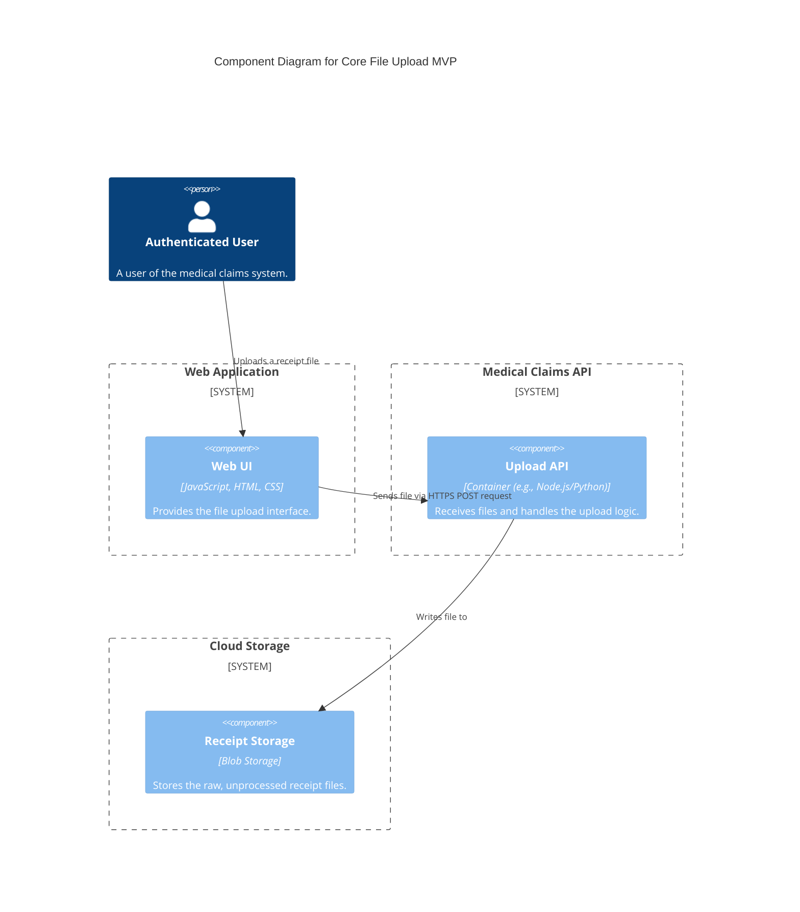
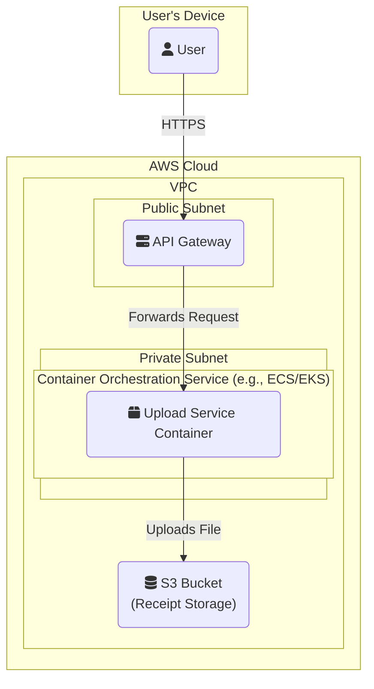

### **Architecture-as-Code (AaC)**

#### **1. Logical View (C4 Component Diagram)**

This diagram shows the primary logical components and their interactions for the initial MVP.

#### **2. Physical View (AWS Deployment Diagram)**

This diagram maps the logical components to a potential physical implementation on AWS using a container-based approach.

#### **3. Component-to-Resource Mapping Table**

This table explicitly connects the logical components to the chosen physical AWS resources.

| **Logical Component** | **Physical AWS Resource**                                   | **Rationale for Choice**                                                                                                                              |
| :-------------------- | :---------------------------------------------------------- | :---------------------------------------------------------------------------------------------------------------------------------------------------- |
| Web UI                | User's Browser                                              | Standard client-side execution environment. The UI will be served from a service like S3/CloudFront, but the code runs on the user's machine.      |
| Upload API            | Container on ECS/EKS                                        | A containerized approach is specified. ECS or EKS provide managed orchestration, allowing for future scalability, though we start with a single instance. |
| (Entry Point)         | API Gateway                                                 | Provides a secure, managed entry point for our API. It handles routing, rate limiting, and can offload concerns like TLS termination.           |
| Receipt Storage       | S3 (Simple Storage Service)                                 | Highly durable, scalable, and cost-effective object storage service, perfect for storing user-uploaded files like images and PDFs.                   |
