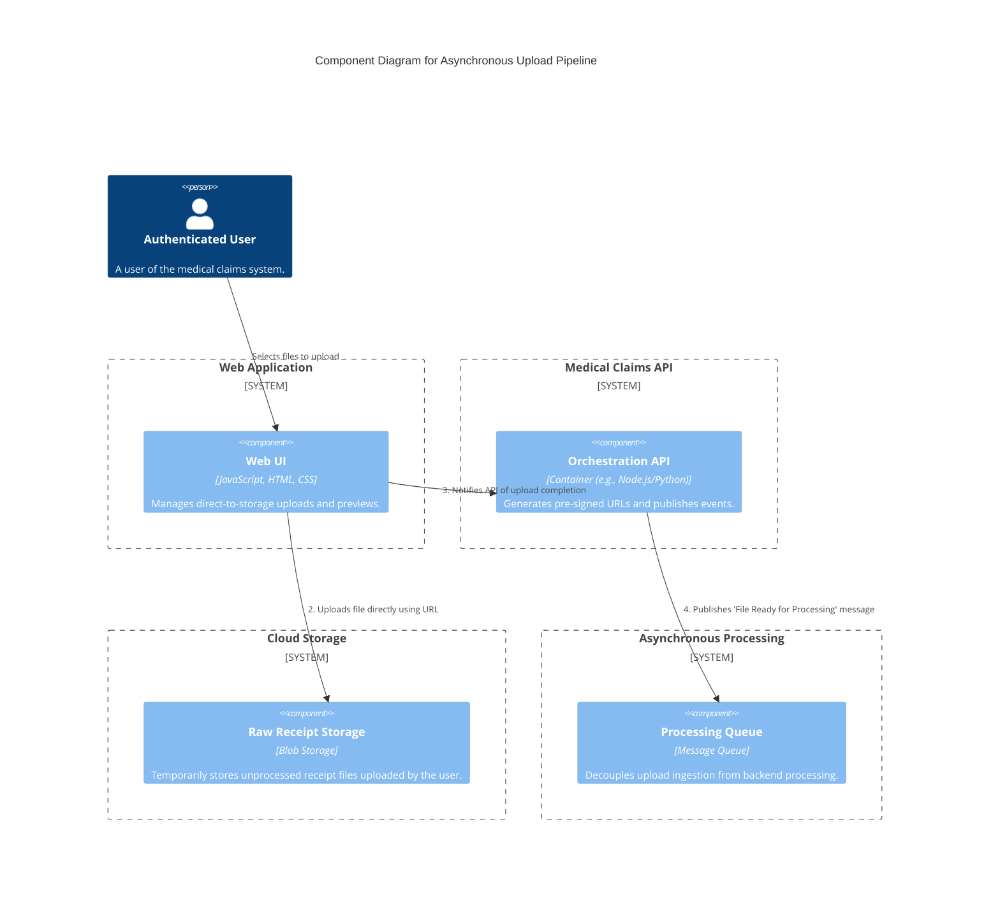
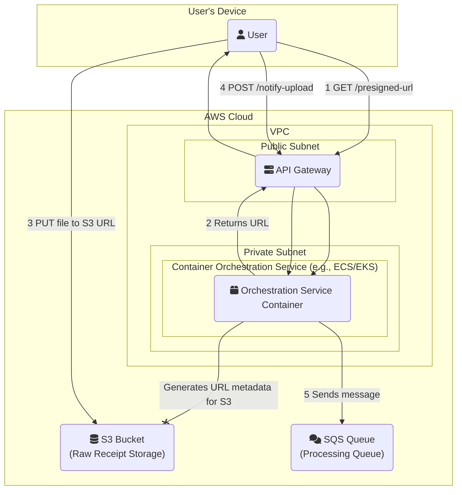

#### **1. Logical View (C4 Component Diagram)**

This diagram shows the new asynchronous flow and the introduction of a message queue.

#### **2. Physical View (AWS Deployment Diagram)**

This diagram maps the new logical components to their physical AWS counterparts.

#### **3. Component-to-Resource Mapping Table**

This table is updated to reflect the new architecture.

| **Logical Component**       | **Physical AWS Resource**                                   | **Rationale for Choice**                                                                                                                                                             |
| :-------------------------- | :---------------------------------------------------------- | :----------------------------------------------------------------------------------------------------------------------------------------------------------------------------------- |
| Web UI                      | User's Browser                                              | Standard client-side execution environment.                                                                                                                                          |
| Orchestration API           | Container on ECS/EKS                                        | Manages the business logic of generating secure upload URLs and dispatching processing jobs. A container allows for easy scaling and deployment.                                    |
| (Entry Point)               | API Gateway                                                 | Continues to provide a secure, managed entry point for all API interactions.                                                                                                         |
| Raw Receipt Storage         | S3 (Simple Storage Service)                                 | S3's pre-signed URL feature is central to this design. It provides a secure, highly scalable, and direct-to-cloud ingestion point, offloading traffic from our service.              |
| **Processing Queue** (New)  | **SQS (Simple Queue Service)**                              | A fully managed message queue that is highly scalable and durable. It perfectly decouples our API from downstream processing, ensuring resilience and enabling independent scaling. |