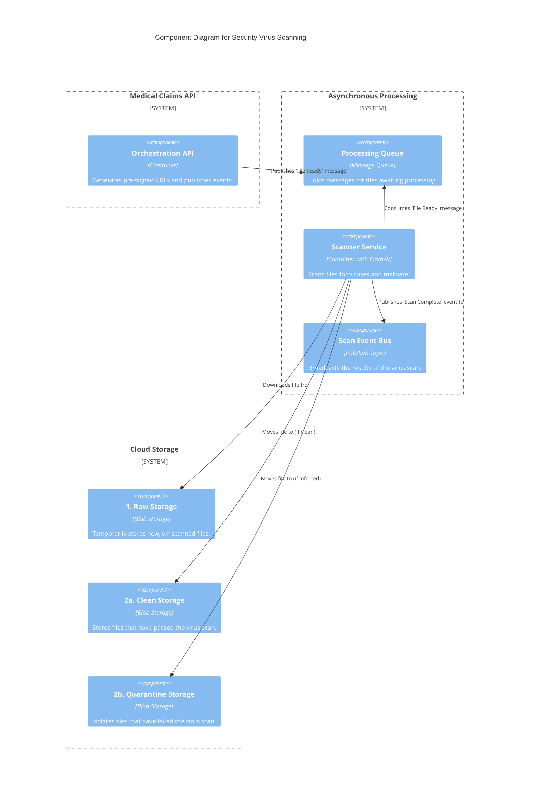
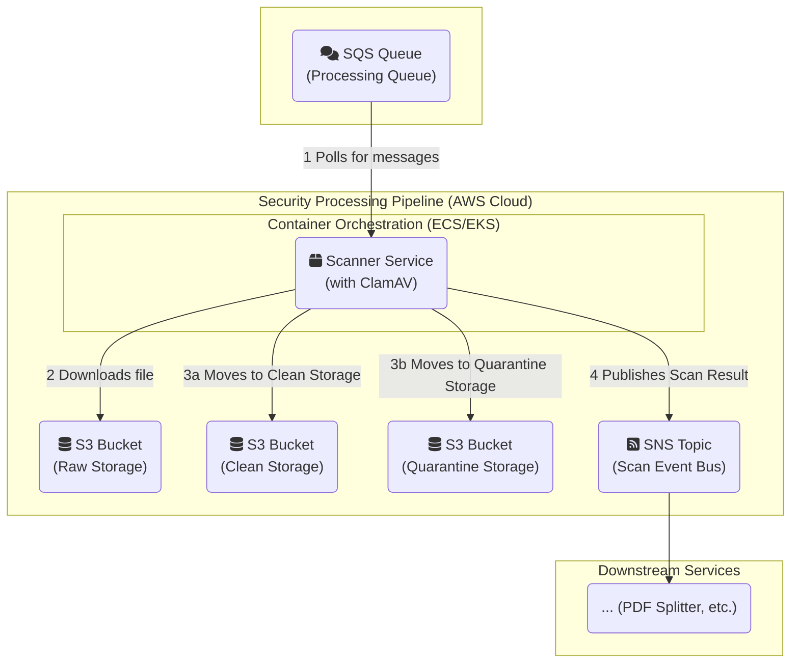

#### **1. Logical View (C4 Component Diagram)**

This diagram integrates the new Scanner component and shows the file's path based on the scan result.

#### **2. Physical View (AWS Deployment Diagram)**

This diagram shows the new physical components integrated into the AWS environment.

#### **3. Component-to-Resource Mapping Table**

This table is updated to include the new security-focused components.

| **Logical Component**       | **Physical AWS Resource**                                   | **Rationale for Choice**                                                                                                                                                             |
| :-------------------------- | :---------------------------------------------------------- | :----------------------------------------------------------------------------------------------------------------------------------------------------------------------------------- |
| Orchestration API           | Container on ECS/EKS                                        | No change.                                                                                                                                                                           |
| Raw Receipt Storage         | S3 Bucket                                                   | No change. Lifecycle policies will be added to delete files after a short period (e.g., 24 hours) to ensure this bucket remains temporary.                                         |
| Processing Queue            | SQS                                                         | No change.                                                                                                                                                                           |
| **Scanner Service** (New)   | **Container on ECS/EKS with EFS**                           | A containerized service is ideal for this isolated task. **EFS (Elastic File System)** is added to provide a shared, writable layer for downloading and updating ClamAV virus definitions. |
| **Clean Storage** (New)     | **S3 Bucket**                                               | A new, secure bucket to serve as the source-of-truth for safe files. It will have stricter access controls than the raw bucket.                                                     |
| **Quarantine Storage** (New)| **S3 Bucket**                                               | A highly restrictive bucket. Access will be limited to security administrators only. It will have policies preventing file retrieval and enabling automated deletion after a set period. |
| **Scan Event Bus** (New)    | **SNS (Simple Notification Service)**                         | SNS provides a pub/sub topic, which is perfect for broadcasting the scan result. Multiple downstream services (PDF splitter, notification service, etc.) can subscribe to this topic independently. |
