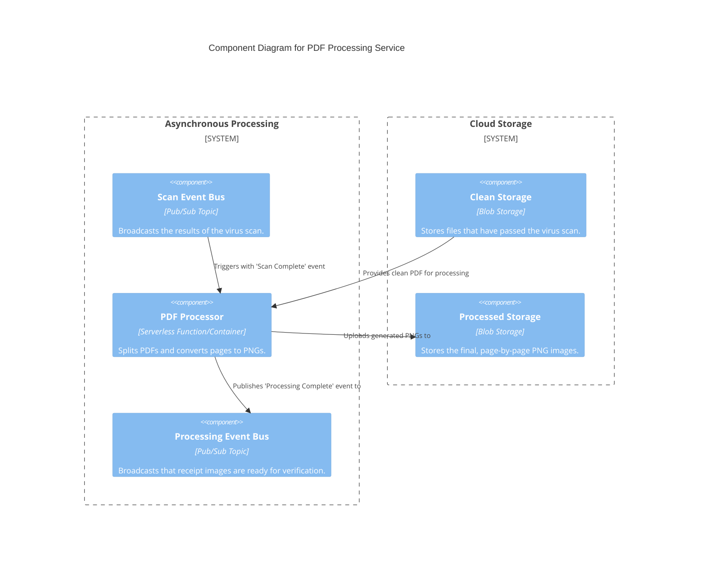
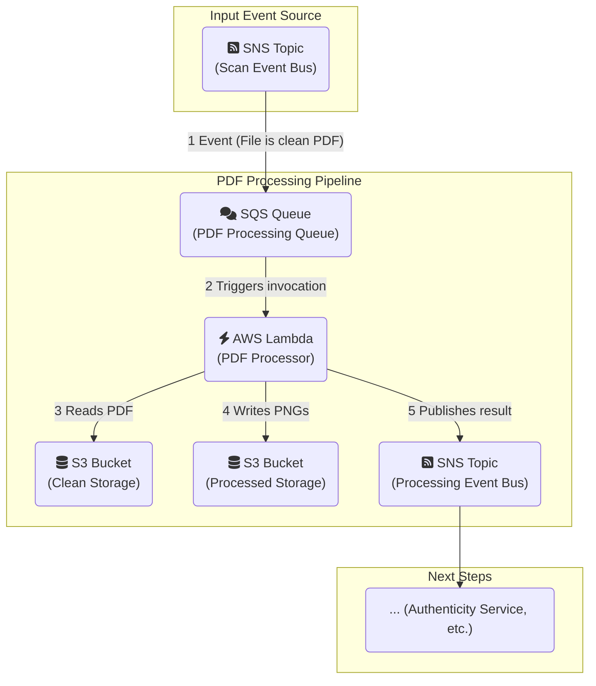

#### **1. Logical View (C4 Component Diagram)**

This diagram shows the new PDF Processor component listening to events from the scanner and creating the final PNG assets.

#### **2. Physical View (AWS Deployment Diagram)**

This diagram shows the physical implementation using AWS Lambda for cost-effective, event-driven compute.

#### **3. Component-to-Resource Mapping Table**

This table is updated with the new PDF processing components.

| **Logical Component**       | **Physical AWS Resource**                                   | **Rationale for Choice**                                                                                                                                                             |
| :-------------------------- | :---------------------------------------------------------- | :----------------------------------------------------------------------------------------------------------------------------------------------------------------------------------- |
| Scan Event Bus              | SNS Topic                                                   | No change. This is the event source for our new service.                                                                                                                           |
| Clean Storage               | S3 Bucket                                                   | No change. This is the source of the clean PDF files to be processed.                                                                                                                |
| **PDF Processor** (New)     | **AWS Lambda Function (+ SQS Queue)**                       | **Lambda** is a perfect fit for this task. It's serverless, event-driven, and scales automatically. We pay only for the compute time used. An **SQS Queue** is placed between SNS and Lambda to act as a resilient buffer, handle retries, and enable a dead-letter queue (DLQ) for failed conversions. |
| **Processed Storage** (New) | **S3 Bucket**                                               | S3 is the ideal, scalable, and cost-effective service for storing the generated PNG artifacts.                                                                                    |
| **Processing Event Bus** (New)| **SNS Topic**                                               | SNS provides the pub/sub mechanism to notify any and all downstream services (like the future Authenticity service) that the processed images are ready.                             |
