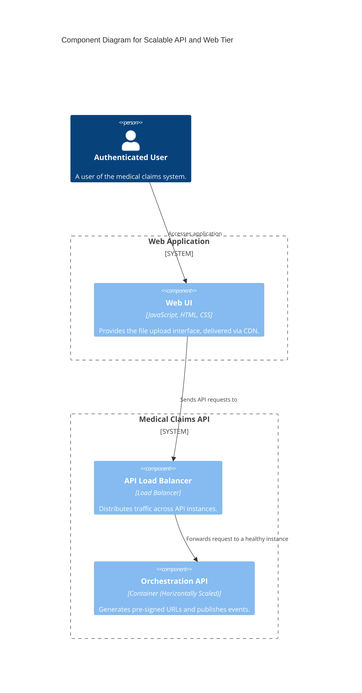
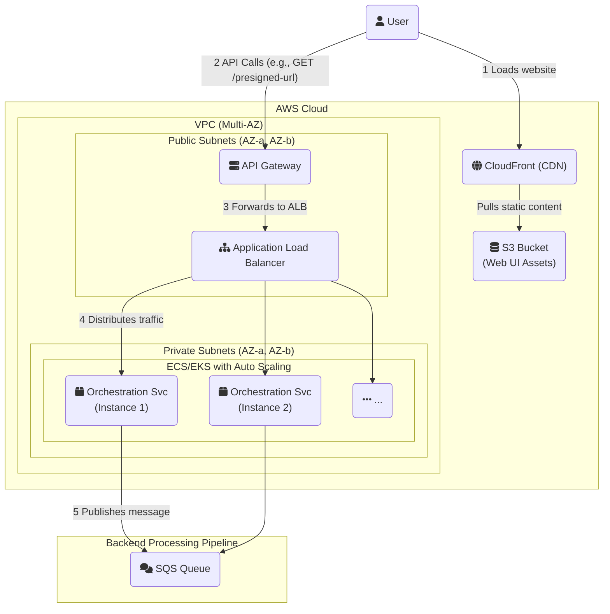

#### **1. Logical View (C4 Component Diagram)**

The logical components remain the same, but we can now add a Load Balancer to show how traffic is managed.

#### **2. Physical View (AWS Deployment Diagram)**

This diagram shows the full, production-ready, scalable architecture for the user-facing services.

#### **3. Component-to-Resource Mapping Table**

| **Logical Component**       | **Physical AWS Resource**                                   | **Rationale for Choice**                                                                                                                                                             |
| :-------------------------- | :---------------------------------------------------------- | :----------------------------------------------------------------------------------------------------------------------------------------------------------------------------------- |
| **Web UI** (Updated)        | **S3 Bucket + CloudFront**                                  | Hosting static assets on S3 is extremely cheap and durable. **CloudFront (CDN)** provides low-latency global delivery and caching, significantly improving performance and user experience. |
| **API Load Balancer** (New) | **Application Load Balancer (ALB)**                         | An ALB is a managed Layer 7 load balancer that is ideal for distributing HTTP/HTTPS traffic to containers. It integrates seamlessly with auto-scaling and provides health checks. |
| **Orchestration API** (Updated)| **ECS/EKS Service with Auto Scaling**                     | An ECS/EKS service manages the deployment and health of our containers. **Auto Scaling** allows the service to elastically add or remove container instances based on load, ensuring performance while optimizing cost. |
