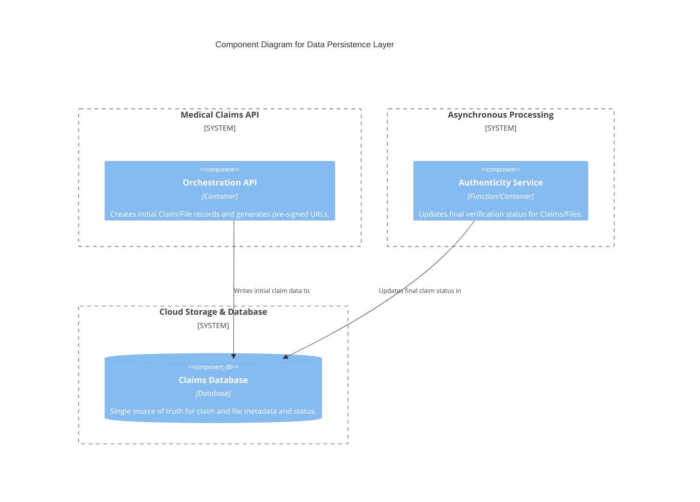
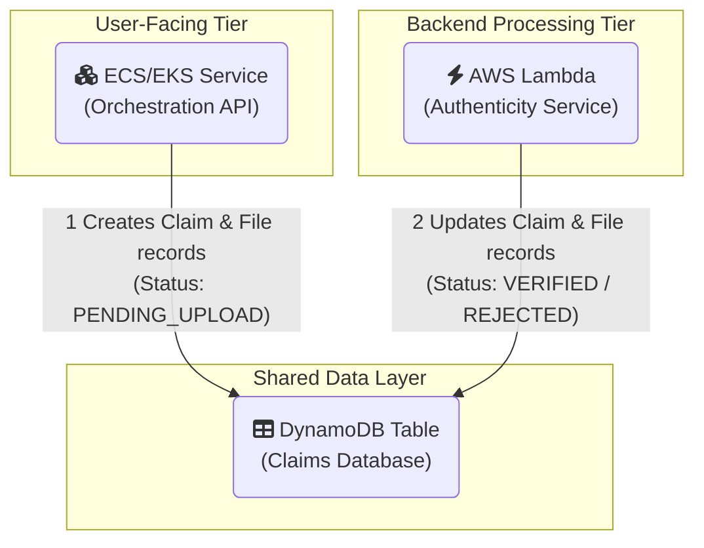

#### **1. Logical View (C4 Component Diagram)**

This diagram shows the `Claims Database` as a central component, now being written to by both the user-facing API and the backend processing services.

#### **2. Physical View (AWS Deployment Diagram)**

This diagram shows both the `Orchestration Service` and the `Authenticity Service` now interacting with the same DynamoDB table.

#### **3. Component-to-Resource Mapping Table**

No new physical resources are introduced, but the responsibilities of existing components are updated.

| **Logical Component**       | **Physical AWS Resource**                                   | **Rationale for Choice (with Updates)**                                                                                                                                                             |
| :-------------------------- | :---------------------------------------------------------- | :-------------------------------------------------------------------------------------------------------------------------------------------------------------------------------------------------- |
| Orchestration API           | ECS/EKS Service with Auto Scaling                           | **Responsibility Update:** In addition to generating pre-signed URLs, this service is now responsible for the initial creation of claim and file records in DynamoDB. This makes the upload process stateful. |
| Authenticity Service        | AWS Lambda Function                                         | **Responsibility Update:** Instead of just performing analysis, this service now has the critical final step of updating the claim and file records in DynamoDB with the final verification status and extracted metadata. |
| **Claims Database**         | **Amazon DynamoDB**                                         | It is now the central state management service for the entire application lifecycle. Its serverless nature, high availability, and low-latency key-value access make it ideal for this role. |
