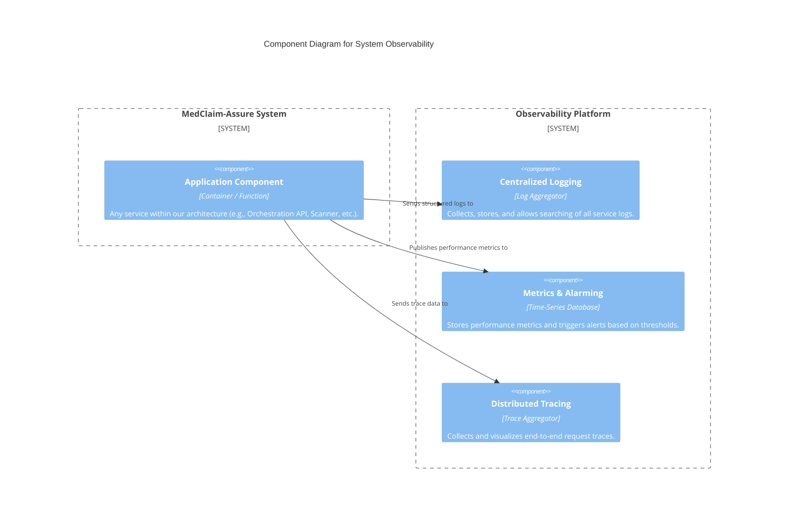
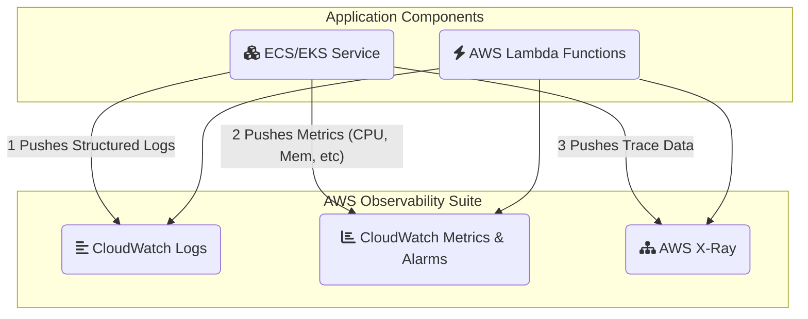

#### **1. Logical View (C4 Component Diagram)**

This diagram shows how our generic application components interact with a unified Observability Platform.

#### **2. Physical View (AWS Deployment Diagram)**

This diagram shows how our physical AWS services integrate with the specific AWS observability services.

#### **3. Component-to-Resource Mapping Table**

| **Logical Component**       | **Physical AWS Resource**                                   | **Rationale for Choice**                                                                                                                                                             |
| :-------------------------- | :---------------------------------------------------------- | :----------------------------------------------------------------------------------------------------------------------------------------------------------------------------------- |
| **Centralized Logging**     | **Amazon CloudWatch Logs**                                  | The native, fully managed logging service in AWS. It integrates seamlessly with virtually all other AWS services (ECS, Lambda, API Gateway), making it the default, easiest choice. |
| **Metrics & Alarming**      | **Amazon CloudWatch Metrics & Alarms**                      | The native monitoring service. It automatically collects many essential metrics from AWS resources and provides a robust engine for creating alarms to notify teams via SNS, email, etc. |
| **Distributed Tracing**     | **AWS X-Ray**                                               | The native distributed tracing service in AWS. Its SDKs make it relatively straightforward to instrument our application code, and it provides the end-to-end visibility we need. |
