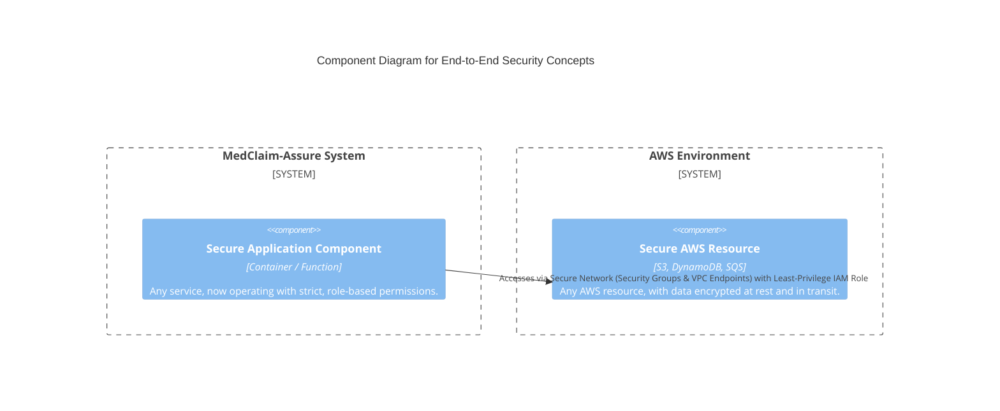
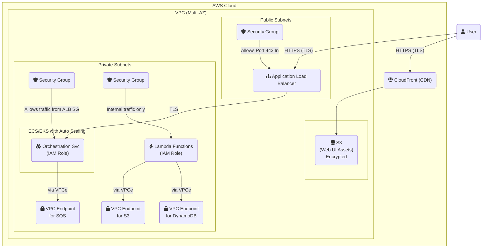

#### **1. Logical View (C4 Component Diagram)**

This diagram shows security as a cross-cutting concern applied to our components.

#### **2. Physical View (AWS Deployment Diagram)**

This is the final, complete production architecture, augmented to show all the security layers working together.

#### **3. Component-to-Resource Mapping Table (Security Focus)**

| **Security Principle**      | **Physical AWS Resource / Feature**                         | **Rationale for Choice**                                                                                                                                                             |
| :-------------------------- | :---------------------------------------------------------- | :----------------------------------------------------------------------------------------------------------------------------------------------------------------------------------- |
| **Encryption at Rest**      | **AWS KMS-Managed Keys** on S3 Buckets & DynamoDB Table     | Using AWS-managed keys (SSE-KMS) provides a simple, secure, and auditable way to enforce encryption on all data stores without the complexity of managing our own encryption keys.   |
| **Encryption in Transit**   | **TLS Certificates on CloudFront & ALB**                    | AWS Certificate Manager (ACM) provides free, auto-renewing TLS certificates that are easily integrated with CloudFront and ALBs, ensuring all user-facing traffic is encrypted. |
| **Least Privilege**         | **IAM Roles for ECS Tasks & Lambda Functions**              | IAM Roles provide temporary, fine-grained credentials to our compute resources. Defining these with minimal permissions (e.g., only access to a specific S3 prefix) is the core of least privilege. |
| **Network Firewall**        | **Security Groups**                                         | Security Groups are stateful firewalls that allow us to create explicit allow-rules for traffic between components, effectively creating a zero-trust network environment.        |
| **Private Networking**      | **VPC Endpoints** (Gateway for S3, Interface for others)    | VPC Endpoints ensure that traffic from our services to other AWS APIs stays within the AWS network, enhancing security by avoiding the public internet.                       |
