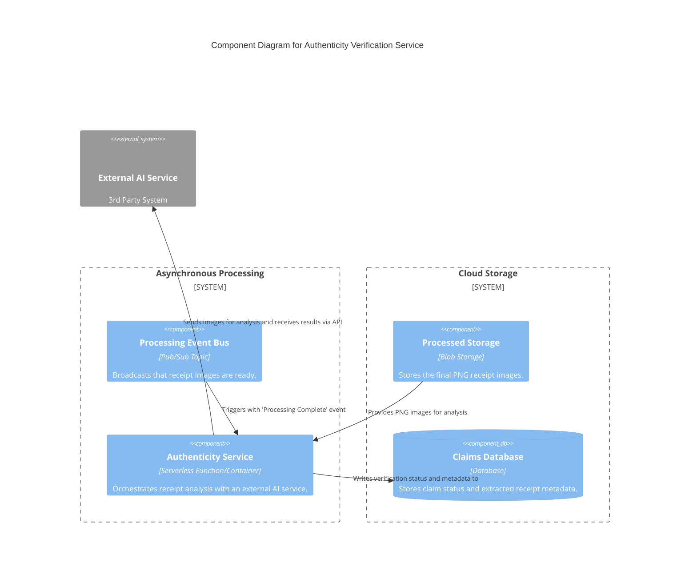
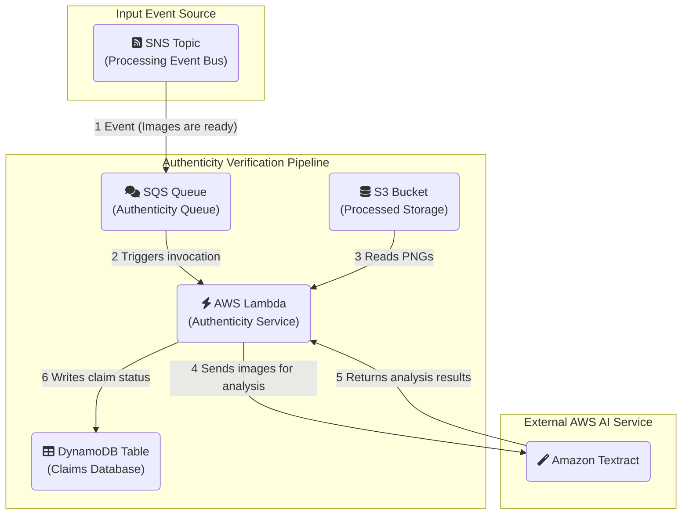

#### **1. Logical View (C4 Component Diagram)**

This diagram introduces the Authenticity Service, its external AI dependency, and the final Claims Database.

#### **2. Physical View (AWS Deployment Diagram)**

This diagram shows the physical implementation, including Amazon Textract as the AI service and DynamoDB as the database.

#### **3. Component-to-Resource Mapping Table**

This final table for our processing pipeline includes the authenticity components.

| **Logical Component**       | **Physical AWS Resource**                                   | **Rationale for Choice**                                                                                                                                                             |
| :-------------------------- | :---------------------------------------------------------- | :----------------------------------------------------------------------------------------------------------------------------------------------------------------------------------- |
| Processing Event Bus        | SNS Topic                                                   | No change. This is the event source for our new service.                                                                                                                           |
| Processed Storage           | S3 Bucket                                                   | No change. This is the source of the final PNG images to be analyzed.                                                                                                                |
| **Authenticity Service** (New) | **AWS Lambda Function (+ SQS Queue)**                       | A serverless function is perfect for this event-driven, stateless task that orchestrates calls to other services. The SQS queue provides resilience and a DLQ for failed analyses. |
| **External AI Service** (New) | **Amazon Textract**                                         | A managed AWS service that specializes in OCR and extracting data from documents like receipts. It's a natural fit, keeping the solution within the AWS ecosystem.             |
| **Claims Database** (New)     | **Amazon DynamoDB**                                         | A fully managed, serverless NoSQL database. It offers excellent performance for the expected workload (writing/reading claim status by a key) and scales seamlessly.                 |
